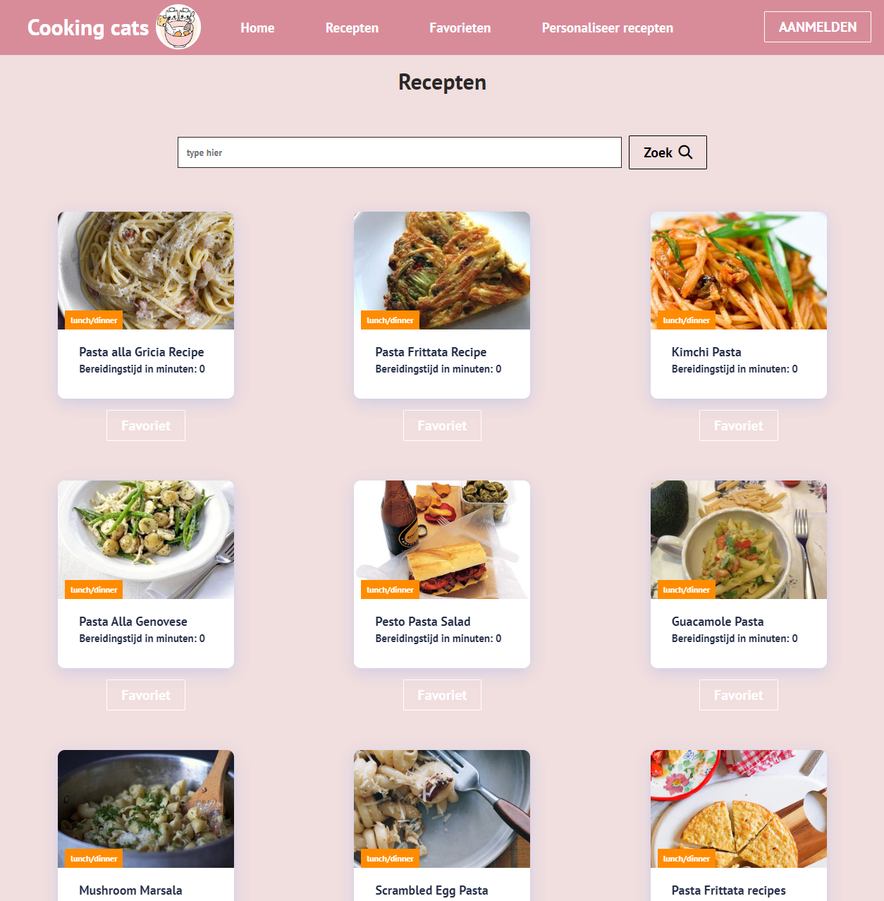

# Cooking cats
## Inleiding
Welkom bij de webapplicatie Cooking cats! 

Heb jij ook vaak geen idee wat je vanavond gaat koken? Geen zorgen, want daar is Cooking cats voor! 
Cooking cats geeft een inspiratie van kook ideeën. In de applicatie zijn er populaire recepten te zien op de voorpagina.

Verder kan je recepten zoeken op basis van steekwoorden (denk hierbij aan gerechttype, receptnamen, ingrediënten). 

Wat Cooking cats nog mooier maakt, is het kunnen opslaan van recepten als favorieten! Je hoeft je dus ook geen zorgen meer te maken dat je een recept niet meer kunt vinden.
De recepten kunnen ook verwijdert worden uit de favorieten.

Natuurlijk kunnen gebruikers zich ook registreren en inloggen in de applicatie. Zodra een gebruiker ingelogd is, kan de gebruiker bij een pagina om gepersonaliseerde recepten te vinden. 
Hierbij beantwoord de gebruiker drie vragen, waarna er passende recepten worden getoond voor de gebruiker.
De favorieten pagina die hiervoor is genoemd, is ook alleen te benaderen als je ingelogd bent.

Hieronder volgt een screenshot van de zoekpagina om een beeld te krijgen bij de applicatie.

## Benodigdheden

- nodejs om de server op te draaien
- een code editor (IDE) zoals IntelliJ om de broncode te openen
- webbrowser zoals Chrome om de applicatie te gebruiken

## Installatie instructies

- Maak een map aan ergens op de C: schrijf en noem het cookingcats
- download de code
- Pak de zip file uit in de map die is gemaakt in de stap hierboven
- Open de map in een IDE of navigeer via een commandline (CMD) naar het pad waarin de cookingcats applicatie bevind
- Als je de applicatie in een IDE hebt geopend, open dan de terminal van de IDE
- Bekijk eerst in welke map je bent met het commando

### `pwd`

- Ga vervolgens naar de cooking-cats-webapp map met het volgende commando of de gehele pad met slashes of backslashes

### `cd cooking-cats-webapp`

- Ga naar de server map met

### `cd server/server`

- Installeer dependencies door middel van het commando

### `npm install`

- Start de server met

### `npm start`

- Open een nieuwe commandline of een nieuw terminal als je in een IDE zit
- Navigeer naar de map cooking-cats-webapp
- Ga naar de client map met

### `cd client`

- Start de applicatie met

### `npm start`

- Open een browser zoals google chrome
- Type in de navigatiebalk: http://localhost:3000
- En voilà! Je bevind je in de webapplicatie Cooking cats!

## Inloggegevens

De applicatie is voor iedereen zichtbaar, dus er hoeft niet ingelogd te worden. Wel kunnen gebruikers zich registreren en ook vervolgens inloggen. 
Wanneer een gebruiker inlogt, heeft hij toegang tot een extra pagina. 

#### LET OP!

Houd er rekening mee dat het registreren bepaalde eisen heeft. 
- Het e-mailadres moet een @ bevatten
- Het wachtwoord en gebruikersnaam moeten minimaal 6 tekens bevatten
- De gebruikersnaam mag nog niet in gebruik zijn
